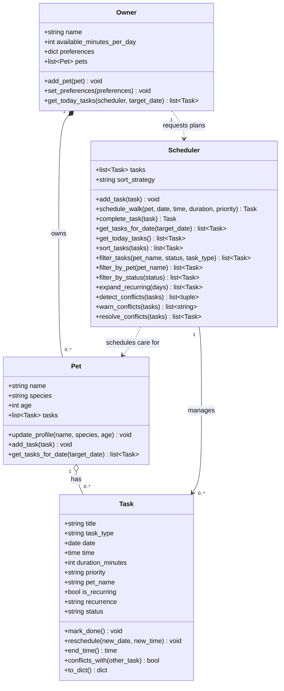

# PawPal+

A smart pet care scheduler built with Python and Streamlit. PawPal+ helps busy pet owners plan daily care tasks across multiple pets — handling priorities, recurring schedules, and time conflicts automatically.

---

## Features

### Sorting
Three sort strategies are available and switchable at runtime via `Scheduler.sort_strategy`:

| Strategy | Behaviour |
|---|---|
| `priority_then_time` *(default)* | High → medium → low priority; clock time as tiebreaker |
| `time_only` | Strict chronological order, ignoring priority |
| `priority_only` | Priority groups only; insertion order preserved within each group |

### Conflict Detection & Warnings
`detect_conflicts()` groups tasks by date before comparing pairs, so cross-date comparisons are skipped entirely. Overlap is checked using a half-open interval: `start < other_end AND other_start < end`.

`warn_conflicts()` returns human-readable strings for each conflicting pair — never raises an exception — so the UI can display them inline without crashing.

### Conflict Resolution
`resolve_conflicts()` uses a greedy priority-first strategy: tasks are sorted by priority, then lower-priority tasks that overlap a higher-priority one are shifted to start immediately after the blocking task ends (`end_time()` + `reschedule()`).

### Daily & Weekly Recurrence
Recurring tasks (`recurrence = "daily"` or `"weekly"`) are handled two ways:

- **On completion** — `complete_task()` marks the task done and automatically appends the next occurrence using `timedelta(days=1)` or `timedelta(weeks=1)`.
- **Bulk pre-population** — `expand_recurring(days=N)` generates all instances for the next N days in one call.

### Filtering
`filter_tasks()` accepts `pet_name`, `status`, and `task_type` and applies all active filters in a single pass. Convenience wrappers `filter_by_pet()` and `filter_by_status()` delegate to the same method.

### Walk Scheduling
`schedule_walk()` creates a walk task and registers it in both the `Scheduler` master list and the individual `Pet` task list atomically — no manual double-add required.

---

## 📸 Demo

<a href="/course_images/ai110/image.png" target="_blank"></a>

---

## System Diagram



---

## Project Structure

```
pawpal_system.py   — Core domain classes: Owner, Pet, Task, Scheduler
app.py             — Streamlit UI
tests/
  test_pawpal.py   — 23 pytest tests covering all core behaviours
uml_final.mmd      — Mermaid source for the class diagram
uml_final.png      — Rendered class diagram
```

---

## Setup

```bash
python -m venv .venv
source .venv/bin/activate       # Windows: .venv\Scripts\activate
pip install -r requirements.txt
```

## Run the App

```bash
streamlit run app.py
```

## Run Tests

```bash
python -m pytest
```

Tests cover:

| Area | What is verified |
|---|---|
| Sorting | `time_only` returns chronological order regardless of priority |
| Sorting | `priority_then_time` orders high → medium → low |
| Recurrence | Completing a `daily` task creates a next-day `pending` occurrence |
| Recurrence | Completing a `weekly` task creates an occurrence exactly 7 days later |
| Recurrence | `expand_recurring()` called twice compounds (known non-idempotent behaviour) |
| Conflict detection | Overlapping tasks on the same date are flagged |
| Conflict detection | Identical start times are flagged |
| Conflict detection | Tasks on different dates are never flagged |
| Conflict detection | Midnight-spanning tasks are a known blind spot (documented) |
| Task lifecycle | `mark_done()`, `reschedule()`, `to_dict()`, `conflicts_with()` |
| Pet | `add_task()`, `get_tasks_for_date()`, `update_profile()` |
| Owner | `add_pet()`, `set_preferences()`, `get_today_tasks()` |
| Scheduler | `add_task()`, `schedule_walk()`, `get_tasks_for_date()` |
